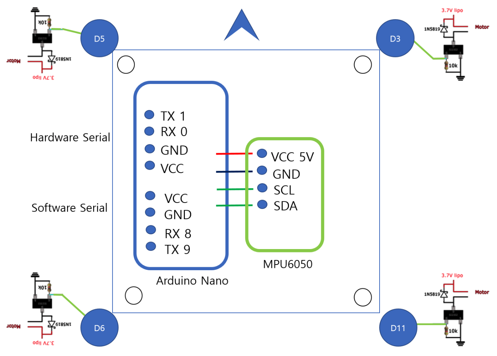

# Arduino Nano(UNO) Multiwii

## Motivation

- I'd like to make quadrotor from scratch.
- Reference : https://www.electronoobs.com/eng_arduino_tut23.php
- I'd like to use my taranis transmitter.
- I'd like to have another serial for MultiwiiConf or Bluetooth.

## Hardware Design

### 1. Uno or Nano has one Hardware Serial.
- This is for receiver (Frsky XM series)
- Frsky receiver(XM) uses 100,000 baud rate, and it should be connected to real Hardware UART.
- SBUS protocol need signal inverter.

### 2. Alt Software serial
- This library uses PIN 8, 9.
- Assign PWM for motor control 3, 5, 6, 11.
- Stable baud rate is 19200 for protocol communication.
- For Bluetooth(HC-05) and FT232 which makes MultiWiiConf connection wireless and wired.

## Basic configuration : config.h

- #define QUADX

- #define GY_521

  6-axis Gyro

- #define SBUS     PITCH,YAW,THROTTLE,ROLL,AUX1,AUX2,AUX3,AUX4,8,9,10,11,12,13,14,15,16,17

  Enable SBUS serial receiver (Futaba, Frsky)

- #define USE_ALT_SOFT_SERIAL

  set PWM motors and enable Alt Software serial

- #define MOTOR_STOP

  stop motor when Armed

## Material
- Motor, Prop : Syma X5 motor (0720)
- Frame : image/frame.stl
- Prototype board : 17x17 (52mm)

## Demo Video
- https://www.youtube.com/watch?v=ynND-c3DFZ0

